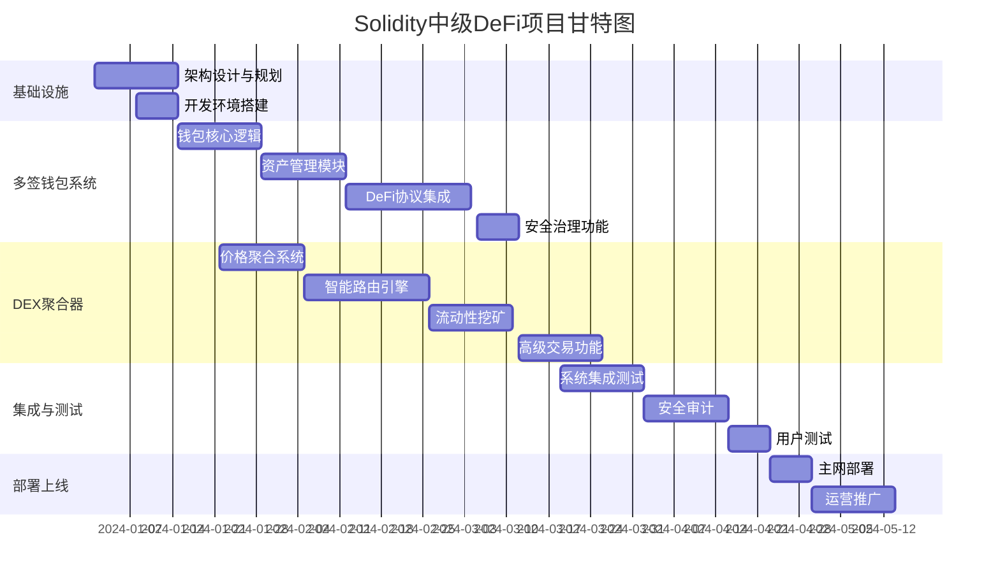

# 🚀 Solidity中级DeFi实战项目 - 总体规划路线图

## 📋 项目总览

**项目目标**: 通过2个核心DeFi项目达到Solidity中级开发水平  
**技术领域**: DeFi生态系统完整解决方案  
**总周期**: 12-16周 (约3-4个月)  
**团队规模**: 8-12人技术团队  
**总预算**: $1.2M - $1.5M

---

## 🎯 双项目协同战略

### **项目组合价值**
- **技术协同**: 共享底层安全框架和Gas优化技术
- **用户协同**: 钱包用户可无缝使用DEX聚合功能
- **数据协同**: 流动性数据和用户行为数据共享
- **品牌协同**: 构建完整DeFi基础设施品牌

### **市场定位策略**
- **差异化定位**: 安全钱包 + 智能交易的一体化解决方案
- **目标市场**: DeFi中高级用户，DAO组织，机构投资者
- **竞争优势**: 更安全的资产管理 + 更智能的交易执行

---

## 📊 项目优先级与依赖关系

### **项目执行策略: 并行开发，分阶段交付**



### **关键依赖关系**
1. **共享基础设施**: 两项目共用安全框架、Gas优化库
2. **数据接口**: DEX聚合器为钱包提供价格数据API
3. **用户认证**: 统一的钱包认证和授权系统
4. **智能合约**: 共享OpenZeppelin库和安全模式

---

## 🏗️ 分阶段执行计划

### **阶段一: 基础设施建设 (第1-2周)**

#### **团队组建与环境准备**
```yaml
目标: 建立完整的开发基础设施
关键任务:
  - [ ] 技术团队招募和培训
  - [ ] 开发环境和工具链搭建
  - [ ] 代码仓库和CI/CD流程
  - [ ] 测试网络和部署环境
  
交付物:
  - ✅ 完整的开发工具链
  - ✅ 标准化的代码规范
  - ✅ 自动化测试框架
  - ✅ 部署和监控系统

资源投入:
  - DevOps工程师 × 1 (全职)
  - 架构师 × 1 (全职)
  - 各项目负责人 × 2 (兼职)
```

#### **架构设计与技术选型**
```yaml
目标: 确定两个项目的技术架构和交互方式
关键任务:
  - [ ] 系统整体架构设计
  - [ ] 智能合约架构规划
  - [ ] 前后端技术栈确定
  - [ ] 安全框架和标准制定
  
交付物:
  - ✅ 技术架构文档
  - ✅ 接口设计规范
  - ✅ 安全设计原则
  - ✅ 项目间集成方案

关键决策:
  - 使用统一的智能合约框架
  - 采用微服务架构支持扩展
  - 建立共享的安全组件库
```

### **阶段二: 核心功能并行开发 (第3-10周)**

#### **多签钱包系统开发 (8周)**
```yaml
Week 3-4: 多签核心逻辑
  优先级: P0 (阻塞后续开发)
  负责人: 智能合约开发团队A
  交付物: 
    - ✅ 多签核心智能合约
    - ✅ 签名者管理功能
    - ✅ 交易提案系统
    - ✅ 紧急恢复机制

Week 5-6: 资产管理模块  
  优先级: P0 (核心用户价值)
  负责人: 智能合约开发团队A + 前端团队A
  交付物:
    - ✅ 多币种资产管理
    - ✅ 批量转账功能
    - ✅ 资产安全控制
    - ✅ 用户界面原型

Week 7-9: DeFi协议集成
  优先级: P1 (差异化功能)
  负责人: DeFi集成专家 + 后端团队
  交付物:
    - ✅ Uniswap/Compound集成
    - ✅ 收益优化策略
    - ✅ 风险管理工具
    - ✅ 协议适配器框架

Week 10: 安全治理功能
  优先级: P1 (企业级特性)
  负责人: 安全工程师 + 治理专家
  交付物:
    - ✅ 时间锁机制
    - ✅ 治理投票系统
    - ✅ 参数管理功能
```

#### **DEX聚合器开发 (8周)**
```yaml
Week 4-5: 价格聚合系统
  优先级: P0 (基础数据来源)
  负责人: 后端开发团队B + 数据工程师
  交付物:
    - ✅ 多DEX价格监控
    - ✅ 实时数据聚合
    - ✅ 流动性深度分析
    - ✅ 价格影响评估

Week 6-8: 智能路由引擎
  优先级: P0 (核心竞争力)
  负责人: 算法工程师 + 智能合约团队B
  交付物:
    - ✅ 最优路径算法
    - ✅ 分片交易策略
    - ✅ MEV保护机制
    - ✅ Gas优化路由

Week 9-10: 流动性挖矿系统
  优先级: P1 (收入来源)
  负责人: 代币经济专家 + 智能合约团队B
  交付物:
    - ✅ 激励代币系统
    - ✅ 流动性策略优化
    - ✅ 收益分配机制
    - ✅ 治理代币功能

Week 11: 高级交易功能
  优先级: P1 (专业用户需求)
  负责人: 量化交易专家 + 全栈团队
  交付物:
    - ✅ 智能订单系统
    - ✅ 套利机会识别
    - ✅ 风险管理工具
    - ✅ API接口完善
```

### **阶段三: 系统集成与优化 (第11-14周)**

#### **跨项目集成开发**
```yaml
Week 11-12: 钱包-DEX集成
  目标: 实现钱包内一键交易功能
  关键任务:
    - [ ] 统一用户认证系统
    - [ ] 钱包内DEX交易界面
    - [ ] 交易状态同步机制
    - [ ] 资产余额实时更新
  
  技术挑战:
    - 跨合约调用优化
    - 用户体验一致性
    - 数据同步性能
    - 错误处理统一

Week 13: 性能优化与Gas优化
  目标: 全系统性能调优和成本优化
  关键任务:
    - [ ] 智能合约Gas优化
    - [ ] 前端性能优化
    - [ ] 数据库查询优化
    - [ ] 缓存策略优化

Week 14: 端到端测试验证
  目标: 验证完整用户流程和系统稳定性
  关键任务:
    - [ ] 用户旅程测试
    - [ ] 压力测试和负载测试
    - [ ] 安全渗透测试
    - [ ] 用户接受度测试
```

### **阶段四: 安全审计与上线准备 (第15-16周)**

#### **安全审计与合规**
```yaml
Week 15: 安全审计
  目标: 确保系统安全性达到生产标准
  关键任务:
    - [ ] 智能合约安全审计
    - [ ] 系统安全评估
    - [ ] 代码安全检查
    - [ ] 漏洞修复和验证

Week 16: 上线准备与部署
  目标: 完成生产环境部署和运营准备
  关键任务:
    - [ ] 主网部署和配置
    - [ ] 监控告警系统
    - [ ] 客户支持流程
    - [ ] 用户文档和教程
```

---

## 💰 资源分配与预算规划

### **人力资源配置**
```yaml
技术开发团队 (11人):
  项目管理:
    - 技术项目经理 × 1
    - 架构师 × 1
  
  智能合约开发:
    - 高级智能合约工程师 × 3
    - DeFi协议专家 × 1
  
  后端开发:
    - 后端开发工程师 × 2
    - 数据工程师 × 1
    - 算法工程师 × 1
  
  前端开发:
    - 前端开发工程师 × 2
  
  基础设施:
    - DevOps工程师 × 1
    - 安全工程师 × 1

产品与运营团队 (4人):
  产品管理:
    - 产品经理 × 1 (John - 当前PM)
    - UI/UX设计师 × 1
  
  运营推广:
    - 社区经理 × 1
    - 营销专员 × 1

外部专家顾问 (3人):
  - DeFi安全审计专家 × 1
  - 代币经济学专家 × 1
  - 法律合规顾问 × 1
```

### **预算详细分解**
```yaml
人力成本 (16周): $960K
  - 技术团队: $720K
  - 产品运营: $160K
  - 外部顾问: $80K

基础设施成本: $72K
  - 云服务器和存储: $36K
  - 开发工具和许可: $18K
  - 监控和安全服务: $18K

审计与合规: $100K
  - 智能合约安全审计: $70K
  - 法律合规咨询: $20K
  - 第三方安全评估: $10K

营销与社区: $150K
  - 品牌建设和设计: $50K
  - 社区建设和活动: $60K
  - PR和媒体推广: $40K

应急储备 (10%): $128K

总预算: $1.41M
```

---

## 📈 风险管理与应急预案

### **关键风险识别**

#### **技术风险 (高)**
```yaml
风险1: 智能合约重大安全漏洞
  概率: 中 (30%)
  影响: 极高 (项目失败)
  缓解措施:
    - 多轮专业安全审计
    - 渐进式资金暴露
    - 紧急暂停机制
    - 漏洞悬赏计划

风险2: 跨项目集成复杂度超预期
  概率: 高 (60%)
  影响: 中 (延期2-4周)
  缓解措施:
    - 提前进行集成测试
    - 预留额外开发时间
    - 简化初版集成功能
    - 分阶段发布策略
```

#### **市场风险 (中)**
```yaml
风险3: 竞争对手快速迭代
  概率: 高 (70%)
  影响: 中 (市场份额影响)
  缓解措施:
    - 快速MVP策略
    - 差异化功能定位
    - 用户粘性建设
    - 合作伙伴生态

风险4: DeFi市场整体下行
  概率: 中 (40%)
  影响: 高 (用户需求下降)
  缓解措施:
    - 多元化功能定位
    - 机构客户开发
    - 成本结构优化
    - 产品迭代调整
```

#### **运营风险 (中)**
```yaml
风险5: 关键人员离职
  概率: 中 (30%)
  影响: 中 (项目延期)
  缓解措施:
    - 知识共享和文档化
    - 关键岗位备份人员
    - 有竞争力的薪酬包
    - 股权激励计划

风险6: 监管政策变化
  概率: 中 (40%)
  影响: 中 (合规成本增加)
  缓解措施:
    - 监管跟踪和预警
    - 合规架构预留
    - 法律顾问持续咨询
    - 灵活的产品设计
```

### **应急预案**

#### **技术应急预案**
```yaml
场景1: 发现智能合约重大漏洞
  响应流程:
    1. 立即触发紧急暂停机制 (0-1小时)
    2. 成立紧急响应小组 (1-2小时)
    3. 评估影响范围和修复方案 (2-8小时)
    4. 实施修复和资金保护措施 (8-24小时)
    5. 公开透明的社区沟通 (24小时内)
    6. 第三方安全审计确认 (1-3天)
    7. 系统恢复和补偿措施 (3-7天)

场景2: 系统性能严重下降
  响应流程:
    1. 监控告警和问题定位 (0-15分钟)
    2. 启动降级服务机制 (15-30分钟)
    3. 紧急扩容和优化 (30分钟-2小时)
    4. 根因分析和彻底修复 (2-8小时)
    5. 性能恢复验证 (8-24小时)
```

#### **项目管理应急预案**
```yaml
场景3: 项目进度严重延期
  响应流程:
    1. 重新评估项目范围和优先级
    2. 调整资源分配和人员配置
    3. 简化非核心功能需求
    4. 分阶段发布和迭代交付
    5. 与stakeholder重新对齐期望

场景4: 关键技术人员离职
  响应流程:
    1. 紧急知识转移和文档整理
    2. 内部人员调配和外部招聘
    3. 外部专家顾问临时支持
    4. 项目优先级和计划调整
    5. 团队稳定性措施加强
```

---

## 🎯 成功标准与验收指标

### **项目整体成功指标**

#### **技术成功指标**
```yaml
代码质量:
  - 智能合约测试覆盖率 ≥ 95%
  - 代码审查通过率 = 100%
  - 安全审计零高危漏洞
  - 性能测试达到设计指标

功能完成度:
  - P0功能完成率 = 100%
  - P1功能完成率 ≥ 80%
  - 用户接受度测试通过率 ≥ 90%
  - 跨项目集成功能正常运行

系统质量:
  - 系统可用性 ≥ 99.9%
  - 响应时间满足用户体验要求
  - Gas优化效果比竞品优化 ≥ 20%
  - 支持预期的并发用户数
```

#### **业务成功指标**
```yaml
用户指标:
  - 钱包注册用户 ≥ 5,000
  - DEX聚合器日活用户 ≥ 1,000
  - 用户留存率(30天) ≥ 40%
  - 用户满意度评分 ≥ 4.5/5

交易指标:
  - 钱包管理资产规模 ≥ $5M
  - DEX聚合器月交易量 ≥ $50M
  - 平均交易成功率 ≥ 99%
  - 交易费用竞争力领先

市场指标:
  - 品牌知名度在目标用户中 ≥ 30%
  - 媒体报道和社区反馈积极
  - 合作伙伴生态初步建立
  - 为后续融资奠定基础
```

#### **学习目标达成指标**
```yaml
技能提升:
  - 团队成员Solidity技能达到中级水平
  - 掌握DeFi核心协议交互开发
  - 具备复杂多合约系统设计能力
  - 理解DeFi产品商业模式

项目经验:
  - 完成完整DeFi产品开发周期
  - 积累安全开发和审计经验
  - 获得用户需求洞察和产品经验
  - 建立DeFi行业人脉网络

知识沉淀:
  - 形成完整的技术文档体系
  - 建立最佳实践和开发规范
  - 沉淀可复用的组件和框架
  - 培养团队持续学习文化
```

---

## 🚀 项目交付与上线计划

### **交付物清单**

#### **技术交付物**
```yaml
智能合约系统:
  - [ ] 多签钱包智能合约套件
  - [ ] DEX聚合器智能合约
  - [ ] 共享安全组件库
  - [ ] 智能合约部署脚本
  - [ ] 合约升级和治理系统

前端应用:
  - [ ] 多签钱包Web应用
  - [ ] DEX聚合器交易界面
  - [ ] 统一的用户认证系统
  - [ ] 移动端适配版本
  - [ ] 管理后台和监控面板

后端服务:
  - [ ] 账户和认证服务
  - [ ] 价格数据聚合服务
  - [ ] 交易执行引擎
  - [ ] 通知和告警服务
  - [ ] 数据分析和报表系统

基础设施:
  - [ ] CI/CD部署流水线
  - [ ] 监控和日志系统
  - [ ] 备份和恢复方案
  - [ ] 安全防护和应急预案
  - [ ] 性能优化和扩容方案
```

#### **文档交付物**
```yaml
技术文档:
  - [ ] 系统架构设计文档
  - [ ] 智能合约技术规范
  - [ ] API接口文档
  - [ ] 部署和运维手册
  - [ ] 安全最佳实践指南

用户文档:
  - [ ] 产品使用指南
  - [ ] 功能操作教程
  - [ ] 常见问题解答
  - [ ] 安全使用建议
  - [ ] 社区参与指南

商业文档:
  - [ ] 产品商业计划书
  - [ ] 代币经济模型
  - [ ] 合规和法律分析
  - [ ] 运营推广策略
  - [ ] 投资者演示材料
```

### **上线发布策略**

#### **分阶段发布计划**
```yaml
Alpha版本 (内部测试):
  时间: 第14周
  范围: 核心功能内部测试
  用户: 内部团队和顾问
  目标: 验证基础功能和用户流程

Beta版本 (公开测试):
  时间: 第15周
  范围: 完整功能公开测试
  用户: 社区早期用户和合作伙伴
  目标: 收集用户反馈和优化产品

正式版本 (主网上线):
  时间: 第16周
  范围: 生产级别完整产品
  用户: 全体目标用户
  目标: 商业化运营和规模增长

迭代版本 (持续优化):
  时间: 上线后持续
  范围: 功能优化和新特性
  用户: 所有用户
  目标: 产品迭代和市场扩展
```

---

## 📊 项目总结与后续规划

### **项目价值总结**
通过这个Solidity中级DeFi实战项目，我们将构建：

1. **技术价值**: 掌握DeFi核心技术栈，具备中级智能合约开发能力
2. **产品价值**: 创造两个有实际用户价值的DeFi产品
3. **商业价值**: 建立可持续的商业模式和收入来源
4. **学习价值**: 获得完整的DeFi产品开发经验
5. **团队价值**: 培养专业的DeFi开发团队

### **后续发展方向**
```yaml
技术进阶:
  - Layer2解决方案集成
  - 跨链协议开发
  - MEV保护和优化
  - DeFi协议创新

产品扩展:
  - 机构级解决方案
  - 移动端原生应用
  - 高级交易工具
  - 社交化DeFi功能

市场发展:
  - 多链生态扩展
  - 国际市场开拓
  - B2B服务模式
  - 生态合作伙伴
```

---

**文档版本**: v1.0  
**创建日期**: 2024年1月  
**负责人**: John (Product Manager)  
**批准人**: 技术委员会 + 执行团队  
**下次审查**: 每月项目review会议

*🚀 通过这个全面的DeFi项目规划，我们将建立起扎实的Solidity中级开发能力，同时创造具有商业价值的产品！这不仅是一个学习项目，更是进入DeFi创业生态的重要起点。*
